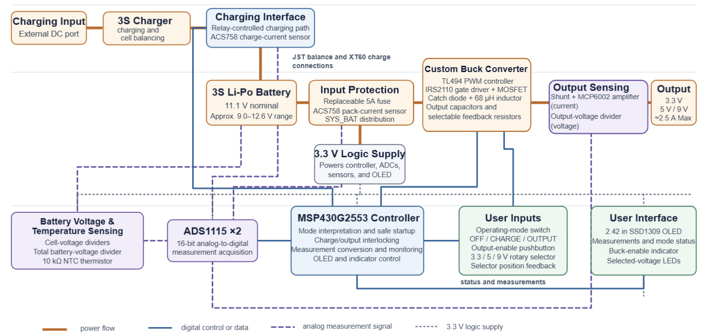
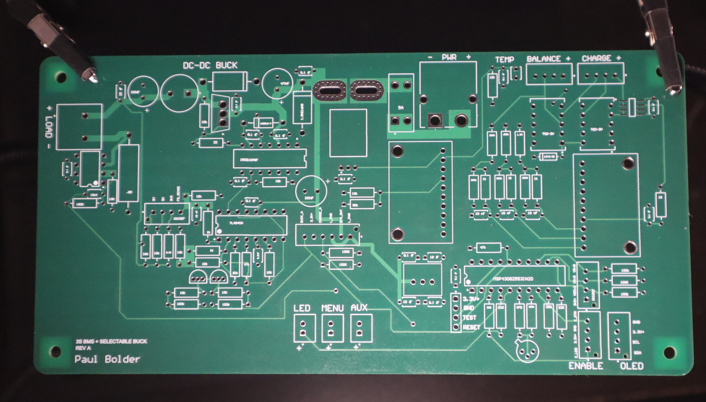
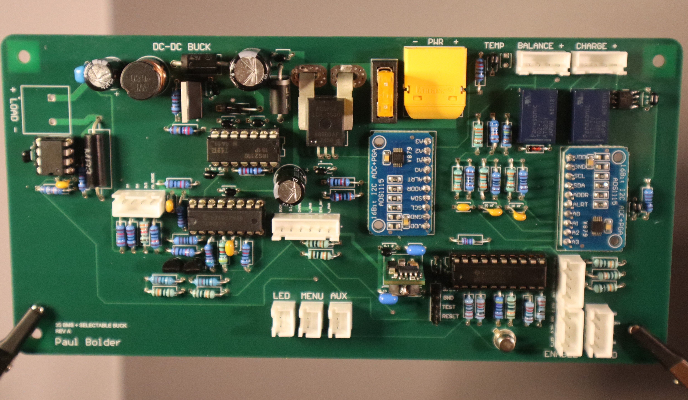
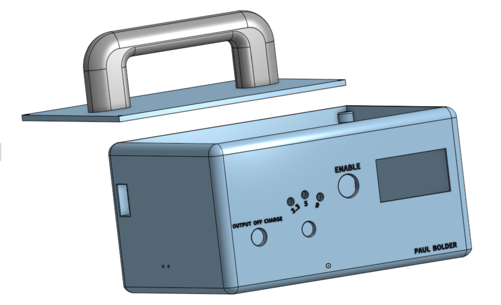
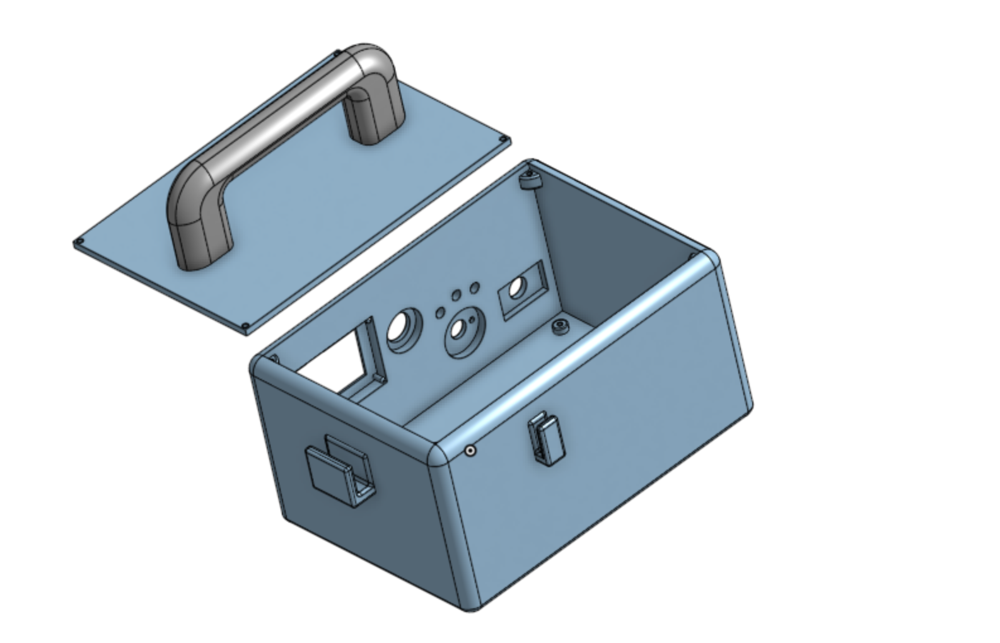
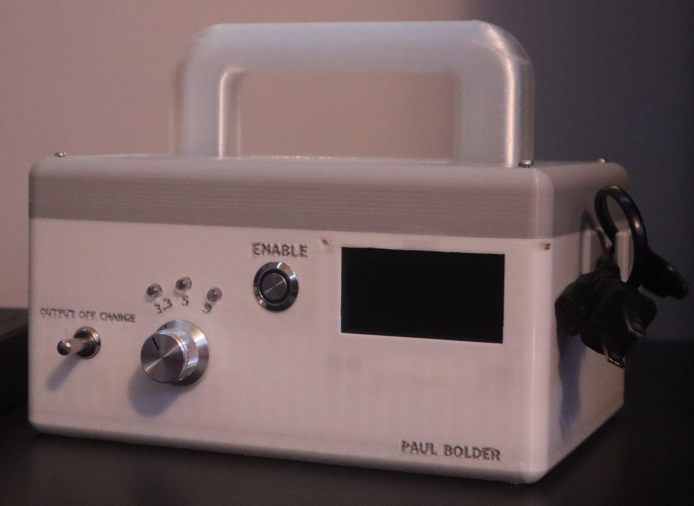
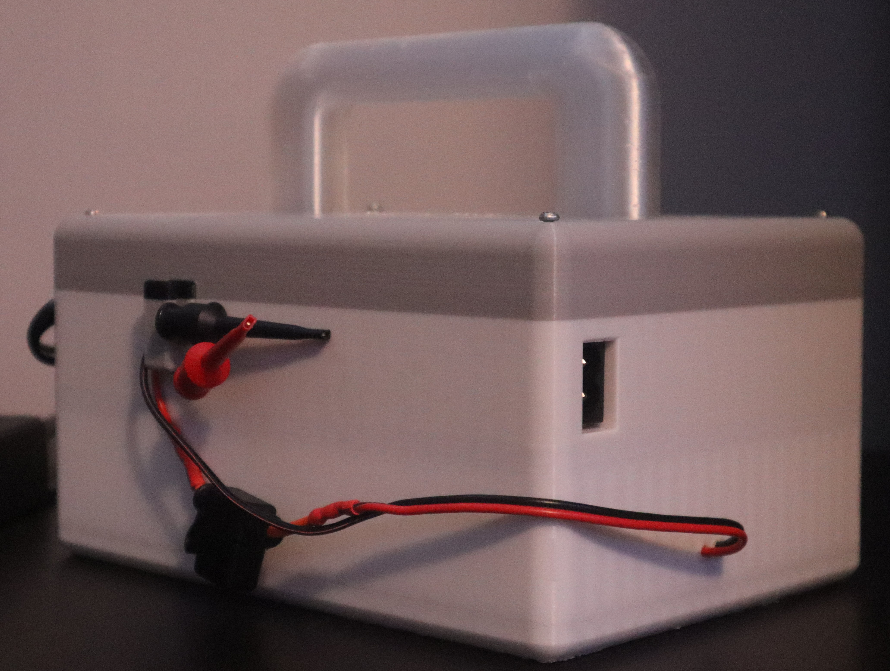
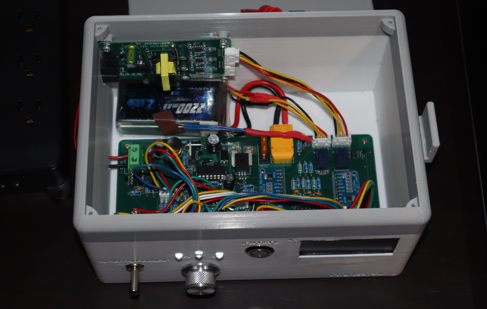
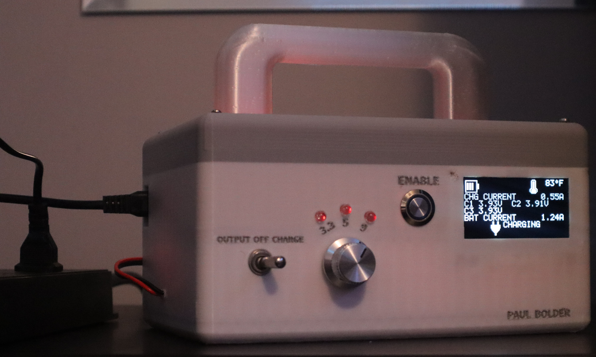
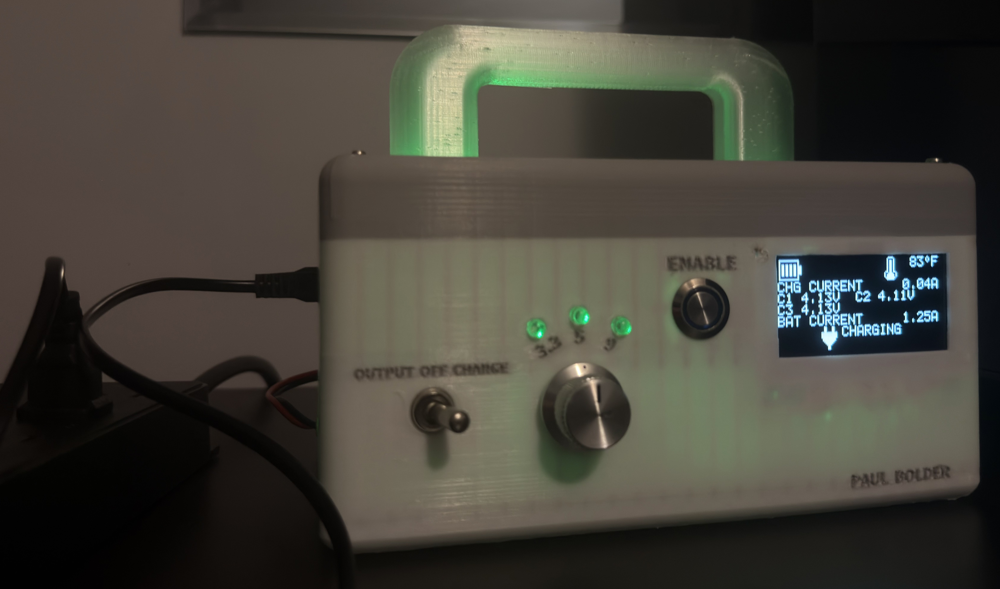

# MSP430 Portable Power Supply

A portable, rechargeable power supply built around an MSP430G2553 and a custom discrete-component buck converter. The device uses a 3S lithium-polymer battery to provide user-selectable 3.3 V, 5 V, and 9 V outputs while monitoring voltage, current, battery condition, and temperature.

**Project documentation:** [Read the full engineering report](https://drive.google.com/file/d/1fpru6yZWugHOVBZUltWJNC6Y1wQsXYS-/view?usp=sharing) · [Electrical schematics](MSP430-Programmable-Power-Supply/hardware/complete-electrical-schematics.pdf) · [Bill of materials](MSP430-Programmable-Power-Supply/hardware/complete-bom.pdf) · [Firmware source](MSP430-Programmable-Power-Supply/firmware)

## Project overview

This project was developed as a portable alternative to a benchtop power supply and as a practical study of power electronics, embedded firmware, mixed-signal PCB design, and mechanical integration. Instead of using a preassembled DC-DC module, the power stage was designed from individual components and implemented on a custom four-layer PCB.

The finished system combines a TL494 PWM controller, IRS2110 gate driver, external MOSFET, 68 µH inductor, selectable analog feedback network, internal 3S charger, electrical and thermal sensing, two ADS1115 ADC modules, an SSD1309 OLED, an MSP430G2553, and a custom 3D-printed enclosure.

### Key results

- Produced selectable 3.3 V, 5 V, and 9 V outputs from a 3S battery.
- Successfully powered LED loads and a 380 brushed DC motor at all three settings.
- Matched OLED output-voltage measurements to a digital multimeter within 0.02 V during completed load tests.
- Implemented mutually exclusive OFF, CHARGE, and OUTPUT modes.
- Added firmware overcurrent and overtemperature shutdown behavior.
- Integrated the battery, charger, PCB, controls, display, and external connections into one portable device.

## Specifications

| Item | Implementation |
|---|---|
| Battery | 3S, 2200 mAh lithium-polymer pack |
| Battery range | Approximately 9.0-12.6 V |
| Microcontroller | Texas Instruments MSP430G2553 |
| Selectable outputs | 3.3 V, 5 V, and 9 V |
| Output-current design target | 2.5 A |
| Firmware overcurrent trip | 2.7 A |
| Power controller and gate driver | TL494 and IRS2110 |
| Display | 2.42-inch, 128x64 SSD1309 OLED |
| PCB | Custom four-layer board, primarily through-hole |
| Enclosure | Custom Onshape design, 3D printed |

## System architecture

The three-position mode switch provides hardware-level separation between charging and output operation. The MSP430 reads the controls and sensors, updates the OLED, and permits the buck converter to operate only when the selected mode and safety state are valid. The TL494 and selectable analog feedback network regulate the output; the MSP430 does not generate the PWM waveform.

| Mode | Charging path | Buck converter | Logic and display |
|---|---|---|---|
| OFF | Disconnected | Disabled | Off |
| CHARGE | Connected through relays | Disabled | Active |
| OUTPUT | Disconnected | Available after enable request | Active |

## Build process

### PCB fabrication and assembly

| Bare four-layer PCB | Completed PCB assembly |
|---|---|
|  |  |

### Enclosure design

The enclosure was modeled in Onshape around the PCB, battery, charger, OLED, switches, wiring, and external connections before being 3D printed.

| Front-panel CAD design | Open-enclosure CAD design |
|---|---|
|  |  |

### Final assembly

| Finished front panel | Rear connections and cable management |
|---|---|
|  |  |

  

### Charging validation

| Charge cycle in progress | Completed charge state |
|---|---|
|  |  |

## Firmware and protection

The firmware is written in C and separated into modules for operating-mode control, input handling, I2C communication, ADS1115 acquisition, sensor conversion, OLED graphics, display screens, timing, and safety logic. The repository contains only the current `.c` and `.h` source files from the CCS project.

The converter starts disabled and requires OUTPUT mode, a user enable request, and a clear safety state before the MSP430 asserts the buck-enable signal. The firmware disables the output when excessive buck current or battery temperature is detected. A 5 A battery-input fuse and a separate 3 A output fuse provide additional hardware protection.

## Measured performance

Testing used a digital multimeter, LED loads, and a 380 brushed DC motor. The multimeter was treated as the reference measurement.

| Selected output | Central multimeter reading | Observed variation | OLED difference |
|---|---:|---:|---:|
| 3.3 V | 3.30 V | +/-0.04 V | +/-0.01 V |
| 5 V | 5.00 V | +/-0.03 V | +/-0.01 V |
| 9 V | 8.95 V | +/-0.07 V | +/-0.02 V |

The shunt-and-op-amp buck-current measurement agreed with the series multimeter measurement within approximately 0.02 A. Charging-current measurement agreed within approximately 0.01 A.

## Hardware bring-up

Initial buck-converter testing opened the input fuse and damaged the MOSFET. Comparing the schematic, PCB footprint, and diode datasheet revealed that the catch-diode footprint reversed its anode and cathode mapping. Installing the diode in the electrically correct orientation and replacing the damaged MOSFET restored normal operation. This reinforced the importance of checking symbol-to-footprint mappings and component polarity directly against manufacturer documentation before fabrication.

## Known limitations and next revision

- Efficiency, output ripple, switching waveforms, transient response, and full-load thermal behavior have not yet been characterized with an oscilloscope and programmable load.
- The 50 A ACS758 total battery-current sensor lacks sufficient resolution for accurate sub-ampere measurement; a lower-range Hall sensor or shunt-based current monitor would be better suited to this system.
- A future PCB revision should correct the catch-diode footprint rather than relying on the assembly correction used on the prototype.

## Author

Designed and built by [Paul Bolder](https://github.com/Pbolder).
